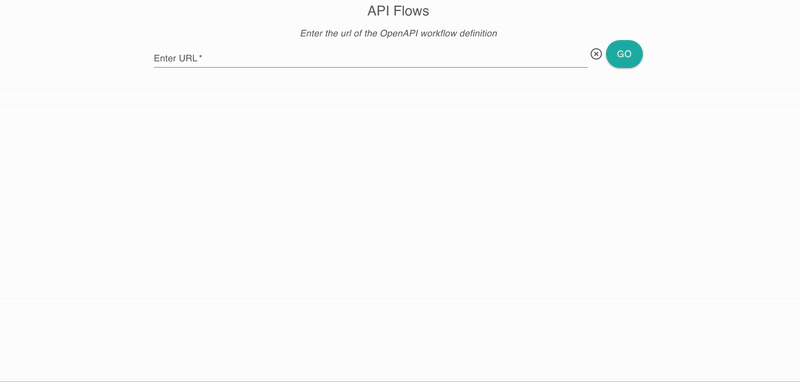

# API Flows Studio

OpenAPI workflow viewer.

## Overview

The API Flows Studio is a web application that loads and displays an OpenAPI workflow file, based on the [OpenAPI SIG-Workflows specification](https://github.com/OAI/sig-workflows).

<p align="center">
    
</p>

## Access the web site

Try it out on [api-flows.com](https://api-flows.com/)

## Run on Gitpod

[](https://gitpod.io/#https://github.com/api-flows/api-flows-studio/tree/main)


## Run on local

Clone from the GitHub repository

```bash
  git clone https://github.com/api-flows/api-flows-studio.git
  cd api-flows-studio
  mvn spring-boot:run
```
